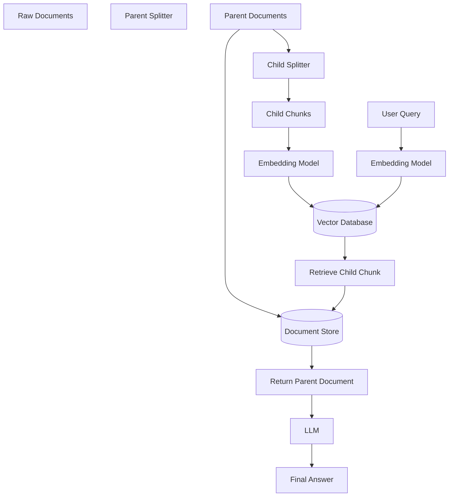

## 1. Introduction

**Parent-Child Retrieval** is a retrieval strategy that stores **small child chunks** in the vector database for accurate semantic search while returning the corresponding **larger parent documents** to the Large Language Model (LLM). This approach combines the retrieval precision of small chunks with the richer context provided by larger documents.

Unlike standard chunk retrieval, which sends only the retrieved chunk to the LLM, Parent-Child Retrieval retrieves a matching child chunk but returns its associated parent document, enabling more complete and context-aware responses.

> Think of it as **searching small pieces but reading the whole section**.

---

# Why It's Needed

## The Problem with Small Chunks

Small chunks improve retrieval accuracy because they contain focused information.

However, they often lack sufficient surrounding context.

Example:

User Query:

> What is Retrieval-Augmented Generation?

Retrieved Chunk:

```
RAG combines retrieval systems with LLMs.
```

This answer is correct but incomplete because it does not explain how retrieval and generation work together.

---

## What Parent-Child Retrieval Adds

- Precise retrieval using small chunks
- Richer context using larger parent documents
- Better answer generation
- Reduced context fragmentation
- Improved factual consistency

---

# Core Concepts

| Concept | Description |
|----------|-------------|
| Parent Document | Large document or section returned to the LLM |
| Child Chunk | Small chunk stored in the vector database |
| Parent Splitter | Creates larger parent documents |
| Child Splitter | Creates smaller searchable chunks |
| Doc Store | Stores parent documents |
| Vector Store | Stores child chunk embeddings |
| ParentDocumentRetriever | Maps retrieved child chunks back to parent documents |

---

# Workflow



---

# Real-Time Example

A company knowledge base contains a 20-page document explaining Artificial Intelligence.

The document is divided into:

- Parent Chunk (1000 tokens)
- Child Chunks (150 tokens each)

User Query:

> Explain Deep Learning.

The vector database retrieves the child chunk discussing Deep Learning.

Instead of sending only that child chunk to the LLM, the retriever returns the complete parent section containing:

- AI Overview
- Machine Learning
- Deep Learning
- Neural Networks
- Applications

The LLM now has sufficient context to generate a more complete and accurate response.

---

# Code Implementation

The complete implementation is available in:

**parent-child-retrieval.py**

---

# Advantages

- Accurate semantic retrieval
- Rich contextual information
- Better answer generation
- Reduces fragmented responses
- Improves RAG performance
- Maintains document coherence

---

# Trade-offs

- Higher storage requirements
- Additional document store needed
- Slightly more complex ingestion pipeline
- Parent retrieval may increase context size

---

# When to Use

Best suited for:

- Enterprise Knowledge Bases
- Long PDFs
- Documentation Search
- Technical Manuals
- Policy Documents
- Legal Documents
- Retrieval-Augmented Generation (RAG)

Less suitable for:

- Small documents
- FAQ datasets
- Very short text collections

---

# Parent-Child Retrieval vs Standard Retrieval

| Feature | Standard Retrieval | Parent-Child Retrieval |
|----------|-------------------|------------------------|
| Stored Chunk | Small | Small Child |
| Returned Chunk | Same Small Chunk | Large Parent Document |
| Retrieval Accuracy | High | High |
| Context | Limited | Rich |
| Answer Quality | Moderate | Excellent |
| Storage | Lower | Higher |
| Best Use Case | Small Documents | Large Documents |