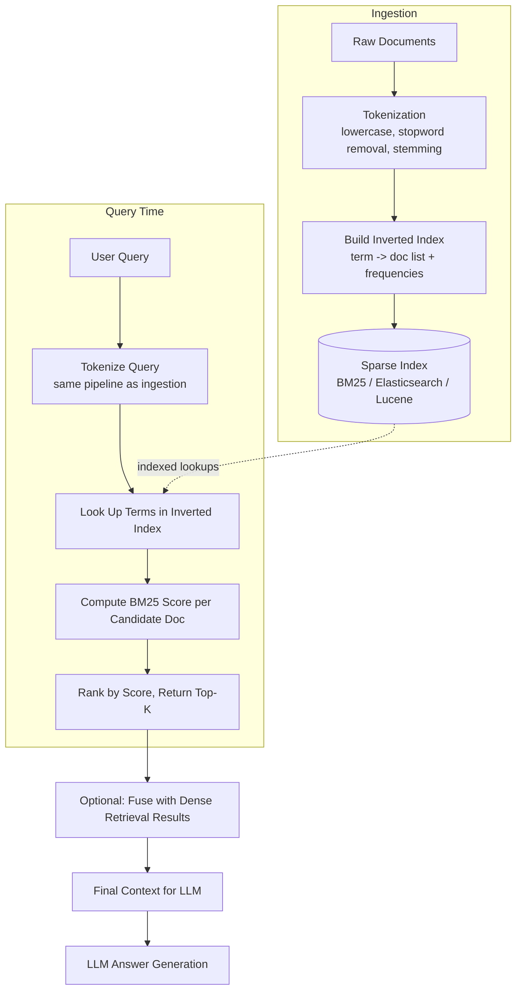

## 1. Introduction

Most modern RAG tutorials jump straight to embeddings and vector search ("dense retrieval"). But long before dense retrieval existed, search engines relied on **sparse, keyword-based retrieval** — and it's still a critical, often superior, component of production RAG systems today.

**Sparse Retrieval** represents documents and queries as high-dimensional, mostly-zero vectors where each dimension corresponds to a specific term (word) in the vocabulary. Relevance is computed based on **exact/lexical term overlap**, weighted by statistical importance — not semantic meaning.

The most widely used algorithm is **BM25** (Best Matching 25), a refinement of TF-IDF (Term Frequency–Inverse Document Frequency).

> **Dense retrieval** asks: "Does this document *mean* the same thing as the query?"
> **Sparse retrieval** asks: "Does this document *contain* the same important words as the query?"

---

## 2. Why It's Still Needed (Even With Embeddings)

Dense (embedding-based) retrieval is excellent at capturing semantic meaning, but it has real weaknesses that sparse retrieval directly compensates for:

| Weakness of Dense Retrieval | How Sparse Retrieval Helps |
|---|---|
| Struggles with **exact identifiers**: product SKUs, error codes, part numbers, legal citations (e.g., "ERR_502", "Section 12.3(a)") | BM25 matches exact tokens precisely — no "semantic guessing" |
| Struggles with **rare/out-of-vocabulary terms** the embedding model wasn't trained on (new acronyms, internal codenames) | Term-frequency statistics don't need the term to be "understood," only present |
| Can hallucinate similarity for **short, ambiguous queries** ("Python" — the language or the snake?) | Exact keyword match anchors retrieval to literal term usage |
| Embeddings can miss **negation and specificity** ("NOT approved" vs "approved" can embed close together) | Keyword match respects exact phrase presence |
| Expensive to re-embed corpus on updates | BM25 index updates are cheap and fully explainable |

**In practice, the best production RAG systems use *hybrid search*: sparse (BM25) + dense (embeddings), combined via re-ranking or score fusion — not one or the other.**

---

## 3. Core Concepts

### 3.1 Term Frequency (TF)
How often a term appears in a document. More occurrences → higher relevance signal (with diminishing returns).

### 3.2 Inverse Document Frequency (IDF)
Terms that appear in *many* documents (like "the", "policy", "report") are less informative than rare terms (like "reimbursement", "throttling"). IDF down-weights common terms and up-weights rare, discriminative ones.

```
IDF(term) = log( (N - n_t + 0.5) / (n_t + 0.5) + 1 )
```

Where `N` = total number of documents, `n_t` = number of documents containing the term.

### 3.3 BM25 Scoring Formula

```
BM25(D, Q) = Σ_{t in Q}  IDF(t) * ( f(t,D) * (k1 + 1) ) / ( f(t,D) + k1 * (1 - b + b * |D|/avgdl) )
```

| Symbol | Meaning |
|---|---|
| `f(t,D)` | frequency of term `t` in document `D` |
| `|D|` | length of document `D` (word count) |
| `avgdl` | average document length across the corpus |
| `k1` | term frequency saturation parameter (typically 1.2–2.0) |
| `b` | length normalization parameter (typically 0.75) |

**Intuition:**
- `k1` controls how much repeated term occurrences matter (saturating curve — the 10th occurrence of a word barely adds more score than the 5th)
- `b` controls how much document length is penalized (long documents naturally contain more term matches by chance, so this normalizes for that)

### 3.4 Inverted Index

Sparse retrieval's efficiency comes from an **inverted index**: instead of scanning every document for a query term, you maintain a mapping of `term → [list of documents containing it]`. This allows sub-linear-time lookups even across millions of documents — the same data structure that powers Elasticsearch, Lucene, and Solr.

```
"reimbursement" → [doc_12, doc_45, doc_88, doc_103]
"throttling"    → [doc_7, doc_45]
"laptop"        → [doc_45, doc_201]
```

---

## 4. Workflow Diagram



---

## 5. Real-Time Example

**Scenario:** A developer support chatbot for a company's API platform, built on RAG over documentation and past support tickets.

**User asks:**
> "What does error ERR_502_GATEWAY mean?"

### Why dense (embedding) retrieval struggles here:
`ERR_502_GATEWAY` is a rare, exact identifier. The embedding model may not have strong training signal for this specific string — it might embed close to *any* text mentioning "error" or "gateway" generically, returning loosely related troubleshooting docs instead of the exact one documenting this code.

### Why sparse (BM25) retrieval wins here:
The inverted index has an exact entry for the token `err_502_gateway` (or its sub-tokens `err`, `502`, `gateway`), directly pointing to the one document titled *"ERR_502_GATEWAY: Upstream Server Timeout — Troubleshooting Guide."* BM25 scores this document extremely high because the rare token exactly matches, and IDF weights it heavily since almost no other document contains this specific code.

**Best real-world outcome:** A **hybrid** pipeline runs both:
- BM25 → correctly surfaces the exact `ERR_502_GATEWAY` doc (lexical precision)
- Dense retrieval → surfaces conceptually related docs like "Understanding 5xx Server Errors" (semantic breadth)

Both get fused (e.g., via Reciprocal Rank Fusion) so the LLM sees the precise match *and* useful surrounding context.

---

## 6. Code Implementation

### 6.1 From Scratch — BM25 with `rank_bm25`

```python
from rank_bm25 import BM25Okapi
import re

def tokenize(text: str):
    text = text.lower()
    tokens = re.findall(r"[a-z0-9_]+", text)
    return tokens

corpus = [
    "ERR_502_GATEWAY: Upstream Server Timeout - Troubleshooting Guide. Occurs when the gateway does not receive a timely response from an upstream server.",
    "Understanding 5xx Server Errors: general causes of server-side failures including 500, 502, 503, and 504 codes.",
    "API rate limiting policy: requests are throttled at 100 requests per minute per API key.",
    "How to reset your password: navigate to account settings and click 'forgot password'.",
]

tokenized_corpus = [tokenize(doc) for doc in corpus]
bm25 = BM25Okapi(tokenized_corpus, k1=1.5, b=0.75)

query = "What does error ERR_502_GATEWAY mean?"
tokenized_query = tokenize(query)

scores = bm25.get_scores(tokenized_query)
ranked_indices = sorted(range(len(scores)), key=lambda i: scores[i], reverse=True)

for idx in ranked_indices:
    print(f"score={scores[idx]:.3f} -> {corpus[idx][:80]}...")
```

**Expected behavior:** the first document (exact `err_502_gateway` token match) scores highest, well above the semantically-related-but-lexically-distinct "5xx Server Errors" doc.

### 6.2 Production-Scale Sparse Retrieval with Elasticsearch

```python
from elasticsearch import Elasticsearch

es = Elasticsearch("http://localhost:9200")

# --- Ingestion: create an index with BM25 similarity (default in ES) ---
es.indices.create(
    index="support_docs",
    body={
        "settings": {
            "similarity": {
                "custom_bm25": {
                    "type": "BM25",
                    "k1": 1.5,
                    "b": 0.75,
                }
            }
        },
        "mappings": {
            "properties": {
                "content": {"type": "text", "similarity": "custom_bm25"},
                "doc_type": {"type": "keyword"},
            }
        },
    },
)

es.index(index="support_docs", document={
    "content": "ERR_502_GATEWAY: Upstream Server Timeout - Troubleshooting Guide.",
    "doc_type": "error_reference",
})

# --- Query time ---
response = es.search(
    index="support_docs",
    query={"match": {"content": "What does error ERR_502_GATEWAY mean?"}},
    size=5,
)

for hit in response["hits"]["hits"]:
    print(hit["_score"], hit["_source"]["content"])
```

### 6.3 Hybrid Search — Fusing Sparse (BM25) + Dense (Embeddings)

```python
from rank_bm25 import BM25Okapi
from langchain_openai import OpenAIEmbeddings
import numpy as np

embeddings_model = OpenAIEmbeddings(model="text-embedding-3-small")

def dense_retrieve(query: str, corpus: list, corpus_embeddings: list, k: int = 5):
    q_emb = np.array(embeddings_model.embed_query(query))
    sims = [
        np.dot(q_emb, np.array(doc_emb)) / (np.linalg.norm(q_emb) * np.linalg.norm(doc_emb))
        for doc_emb in corpus_embeddings
    ]
    ranked = sorted(range(len(sims)), key=lambda i: sims[i], reverse=True)[:k]
    return ranked  # list of doc indices, best first


def sparse_retrieve(query: str, bm25: BM25Okapi, k: int = 5):
    scores = bm25.get_scores(tokenize(query))
    ranked = sorted(range(len(scores)), key=lambda i: scores[i], reverse=True)[:k]
    return ranked


def reciprocal_rank_fusion(rank_lists: list, k: int = 60):
    fused_scores = {}
    for rank_list in rank_lists:
        for rank, doc_idx in enumerate(rank_list):
            fused_scores.setdefault(doc_idx, 0.0)
            fused_scores[doc_idx] += 1.0 / (k + rank + 1)
    return sorted(fused_scores, key=lambda x: fused_scores[x], reverse=True)


# --- Build both indexes ---
corpus_embeddings = [embeddings_model.embed_query(doc) for doc in corpus]
bm25_index = BM25Okapi(tokenized_corpus)

# --- Hybrid retrieval ---
query = "What does error ERR_502_GATEWAY mean?"
sparse_ranked = sparse_retrieve(query, bm25_index, k=5)
dense_ranked = dense_retrieve(query, corpus, corpus_embeddings, k=5)

final_ranking = reciprocal_rank_fusion([sparse_ranked, dense_ranked])

print("Final hybrid ranking (doc indices, best first):", final_ranking)
for idx in final_ranking:
    print(f"-> {corpus[idx][:80]}...")
```

---

## 7. Sparse vs. Dense Retrieval — Side-by-Side

| Aspect | Sparse (BM25 / Keyword) | Dense (Embeddings) |
|---|---|---|
| **Matching basis** | Exact/lexical term overlap | Semantic similarity |
| **Handles synonyms/paraphrase** | ❌ Poor | ✅ Strong |
| **Handles exact IDs, codes, rare terms** | ✅ Strong | ❌ Poor |
| **Explainability** | ✅ Fully transparent (term scores) | ❌ Opaque (vector math) |
| **Index update cost** | ✅ Cheap, incremental | ⚠️ Requires re-embedding |
| **Infra maturity** | ✅ Decades-old (Lucene, Elasticsearch, Solr) | ✅ Newer but well-supported (Pinecone, Weaviate, etc.) |
| **Cold-start on new vocabulary** | ✅ Works immediately | ❌ Needs terms "seen" during embedding training |
| **Query latency at scale** | ✅ Very fast (inverted index) | ✅ Fast (ANN algorithms like HNSW) |

---

## 8. Advantages of Sparse Retrieval

- **Precision on exact terms** — ideal for IDs, codes, names, legal/medical terminology
- **No embedding drift** — doesn't depend on an embedding model's training distribution
- **Fully explainable** — you can see exactly which terms contributed to a score
- **Cheap and fast to update** — adding new documents doesn't require expensive re-embedding
- **Battle-tested infrastructure** — Elasticsearch/OpenSearch/Solr are mature, scalable, well-understood systems

## 9. Trade-offs & Limitations

- **No semantic understanding** — "car" and "automobile" are treated as completely unrelated tokens unless both appear
- **Sensitive to phrasing/typos** — misspellings or unusual phrasing reduce match quality
- **Requires good tokenization/stemming** — poor preprocessing (e.g., not handling plurals, case) hurts recall
- **Struggles with conceptual/open-ended queries** — "What are some ways to improve team morale?" has no strong keyword anchor

## 10. When to Use Sparse (Keyword) Retrieval

Best suited for:
- Technical/support systems with error codes, SKUs, ticket numbers, exact identifiers
- Legal, medical, or compliance domains where exact terminology matters
- Systems needing full explainability of why a document was retrieved
- As one half of a **hybrid retrieval** pipeline (recommended default for most production RAG systems)

Less critical for:
- Purely conversational, paraphrase-heavy queries where meaning matters more than wording
- Small corpora where you can afford dense-only retrieval with strong embeddings

## 11. Best Practice: Default to Hybrid

In production, most mature RAG systems **do not choose** between sparse and dense — they run both and fuse results (via Reciprocal Rank Fusion or a learned re-ranker). This captures the lexical precision of BM25 and the semantic breadth of embeddings simultaneously, and is the approach used by systems like Elasticsearch's "ELSER + BM25", Weaviate's hybrid search, and Pinecone's sparse-dense hybrid indexes.
