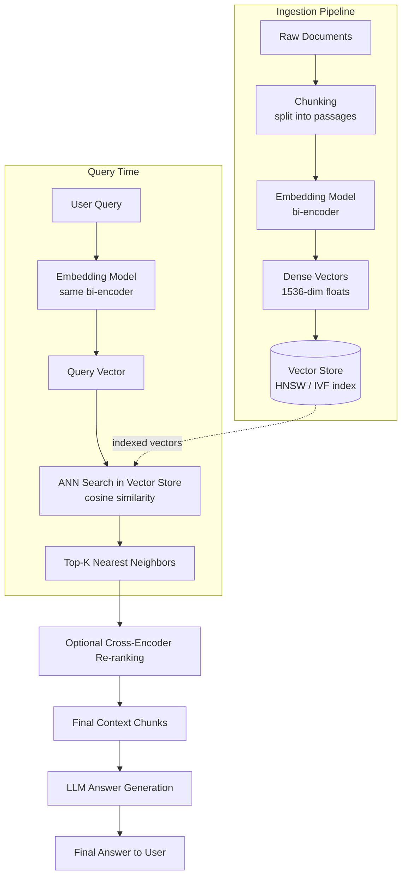

## 1. Introduction

**Dense Retrieval** is the retrieval method most people associate with modern RAG systems. Instead of representing text as sparse, mostly-zero vectors of individual terms (like BM25/TF-IDF), dense retrieval represents each piece of text — query or document — as a **dense, low-dimensional numeric vector (an embedding)** produced by a neural network, where every dimension carries some learned semantic signal.

> **Sparse retrieval** asks: "Does this document contain the same *words* as the query?"
> **Dense retrieval** asks: "Does this document *mean* the same thing as the query, even with completely different words?"

Because embeddings are trained on massive text corpora to place semantically similar content close together in vector space, dense retrieval can match a query like *"How do I stop my membership?"* to a document that says *"Steps to terminate your subscription plan"* — even though **not a single word overlaps**.

This is the foundational retrieval technique behind vector databases like Pinecone, Weaviate, Qdrant, Chroma, Milvus, and pgvector.

---

## 2. Core Concepts

### 2.1 Embeddings

An **embedding** is a fixed-length vector of real numbers (e.g., 1536 dimensions for OpenAI's `text-embedding-3-small`) that encodes the semantic meaning of a piece of text. Embeddings are produced by a neural encoder model trained via **contrastive learning** — the model learns to pull semantically similar text pairs closer together in vector space and push dissimilar pairs apart.

```
"How do I cancel my subscription?"      → [0.021, -0.114, 0.087, ..., 0.003]  (1536 dims)
"Steps to terminate your membership"    → [0.019, -0.109, 0.091, ..., 0.005]  (1536 dims)
"What's the weather today?"             → [-0.442, 0.318, -0.076, ..., 0.221] (1536 dims)
```

The first two vectors will be **close together** in vector space (high cosine similarity) despite sharing no words. The third will be **far away**.

### 2.2 Similarity Metrics

| Metric | Formula (conceptual) | Notes |
|---|---|---|
| **Cosine Similarity** | `dot(A,B) / (‖A‖ * ‖B‖)` | Most common; measures angle between vectors, ignores magnitude |
| **Dot Product** | `dot(A,B)` | Faster; equivalent to cosine if vectors are normalized |
| **Euclidean (L2) Distance** | `sqrt(Σ(A_i - B_i)²)` | Measures straight-line distance; lower = more similar |

Most modern embedding models (OpenAI, Cohere, sentence-transformers) are trained/normalized such that **cosine similarity** or **dot product** work best.

### 2.3 Bi-Encoders vs. Cross-Encoders

| Architecture | How It Works | Speed | Accuracy |
|---|---|---|---|
| **Bi-Encoder** (used for dense retrieval) | Query and document are embedded **independently**, then compared via cosine similarity | ✅ Fast — documents pre-embedded offline; only the query needs embedding at search time | ⚠️ Good, but misses fine-grained query-document interactions |
| **Cross-Encoder** (used for re-ranking) | Query and document are fed **together** into the model, which outputs a single relevance score | ❌ Slow — must run inference for every (query, doc) pair at query time | ✅ Much higher accuracy |

This is why production systems use bi-encoders (dense retrieval) for the initial fast candidate search over millions of documents, then a cross-encoder to **re-rank** just the top ~20-50 candidates for precision.

### 2.4 Approximate Nearest Neighbor (ANN) Search

Computing exact cosine similarity against millions of vectors for every query is too slow. Vector databases use **ANN algorithms** to find near-optimal matches in sub-linear time:

- **HNSW** (Hierarchical Navigable Small World) — graph-based, used by most vector DBs (Weaviate, Qdrant, Pinecone, pgvector)
- **IVF** (Inverted File Index) — clusters vectors, searches only relevant clusters (used by FAISS)
- **PQ** (Product Quantization) — compresses vectors for memory efficiency at slight accuracy cost

### 2.5 Chunking Strategy

Dense retrieval quality depends heavily on how source documents are split into chunks before embedding:

- **Fixed-size chunking** — split every N tokens (simple, but can cut sentences awkwardly)
- **Recursive/semantic chunking** — split along paragraph/sentence boundaries, keeping meaning intact
- **Chunk overlap** — small overlap (e.g., 10-20%) between consecutive chunks preserves context across boundaries

---

## 3. Workflow Diagram



---

## 4. Real-Time Example

**Scenario:** A customer support RAG chatbot for a SaaS product.

**User asks:**
> "My invoice looks wrong, can someone check it?"

**Relevant document in the knowledge base** (written by a different team, different wording):
> *"Billing discrepancies: if your monthly statement doesn't match your expected charges, contact billing support for a reconciliation review."*

### Why keyword/sparse search would likely miss this:
Zero literal word overlap between "invoice looks wrong" and "billing discrepancies... reconciliation review." A BM25 search would score this document low or not retrieve it at all.

### Why dense retrieval succeeds:
The embedding model has learned — from training on massive text — that "invoice," "billing," "statement," and "charges" occupy a similar semantic neighborhood, and that "looks wrong" and "discrepancies" both express the concept of an error/mismatch. The query vector lands close to the document vector in embedding space, even with completely different surface wording, so it's retrieved as a top match.

**Follow-up nuance:** if the user instead asked *"What does error code BIL-4092 mean?"*, dense retrieval alone might struggle (rare exact identifier) — which is exactly the case where **hybrid search with sparse retrieval** (see the companion doc on Keyword-based Retrieval) becomes essential. Dense and sparse retrieval are complementary, not competing.

---

## 5. Code Implementation

### 5.1 Basic Dense Retrieval — From Scratch (No Framework)

```python
import numpy as np
from openai import OpenAI

client = OpenAI()

def embed(text: str) -> np.ndarray:
    resp = client.embeddings.create(model="text-embedding-3-small", input=text)
    return np.array(resp.data[0].embedding)

def cosine_similarity(a: np.ndarray, b: np.ndarray) -> float:
    return float(np.dot(a, b) / (np.linalg.norm(a) * np.linalg.norm(b)))

# --- Ingestion: embed the corpus once ---
corpus = [
    "Billing discrepancies: if your monthly statement doesn't match your expected charges, contact billing support for a reconciliation review.",
    "Steps to terminate your membership plan: go to Settings > Billing > Cancel.",
    "API rate limiting policy: requests are throttled at 100 requests per minute.",
    "How to reset your password: navigate to account settings.",
]
corpus_embeddings = [embed(doc) for doc in corpus]

# --- Query time ---
def dense_retrieve(query: str, k: int = 3):
    q_emb = embed(query)
    scored = [
        (cosine_similarity(q_emb, doc_emb), doc)
        for doc_emb, doc in zip(corpus_embeddings, corpus)
    ]
    scored.sort(key=lambda x: x[0], reverse=True)
    return scored[:k]

results = dense_retrieve("My invoice looks wrong, can someone check it?")
for score, doc in results:
    print(f"{score:.3f} -> {doc}")
```

### 5.2 Production Dense Retrieval with Chroma

```python
from langchain_openai import OpenAIEmbeddings
from langchain_community.vectorstores import Chroma
from langchain_core.documents import Document

embeddings = OpenAIEmbeddings(model="text-embedding-3-small")

docs = [
    Document(page_content="Billing discrepancies: if your monthly statement doesn't match expected charges, contact billing support."),
    Document(page_content="Steps to terminate your membership plan: Settings > Billing > Cancel."),
    Document(page_content="API rate limiting policy: 100 requests per minute per key."),
]

vectorstore = Chroma.from_documents(docs, embeddings, collection_name="support_kb")

retriever = vectorstore.as_retriever(
    search_type="similarity",   # or "mmr" for diversity-aware retrieval
    search_kwargs={"k": 3},
)

results = retriever.invoke("My invoice looks wrong, can someone check it?")
for r in results:
    print(r.page_content)
```

### 5.3 Scalable ANN Search with FAISS (Millions of Vectors)

```python
import faiss
import numpy as np

dimension = 1536

# HNSW index — fast approximate nearest neighbor search
index = faiss.IndexHNSWFlat(dimension, 32)  # 32 = neighbors per node
index.hnsw.efConstruction = 200
index.hnsw.efSearch = 64

# Add pre-computed embeddings (e.g., from corpus_embeddings above)
vectors = np.array(corpus_embeddings).astype("float32")
faiss.normalize_L2(vectors)  # normalize for cosine similarity via inner product
index.add(vectors)

# Query
query_vector = embed("My invoice looks wrong, can someone check it?").astype("float32").reshape(1, -1)
faiss.normalize_L2(query_vector)

k = 3
distances, indices = index.search(query_vector, k)

for rank, idx in enumerate(indices[0]):
    print(f"Rank {rank+1}: score={distances[0][rank]:.3f} -> {corpus[idx]}")
```

### 5.4 Dense Retrieval + Cross-Encoder Re-ranking (Two-Stage Pipeline)

```python
from sentence_transformers import CrossEncoder

# Stage 1: fast dense retrieval (bi-encoder) gets top-20 candidates
candidates = dense_retrieve("My invoice looks wrong, can someone check it?", k=20)
candidate_texts = [doc for _, doc in candidates]

# Stage 2: slow, accurate cross-encoder re-ranks the top-20 down to top-3
cross_encoder = CrossEncoder("cross-encoder/ms-marco-MiniLM-L-6-v2")

query = "My invoice looks wrong, can someone check it?"
pairs = [[query, doc] for doc in candidate_texts]
rerank_scores = cross_encoder.predict(pairs)

reranked = sorted(zip(rerank_scores, candidate_texts), key=lambda x: x[0], reverse=True)

for score, doc in reranked[:3]:
    print(f"{score:.3f} -> {doc}")
```

### 5.5 Chunking Before Embedding (Recursive Character Splitting)

```python
from langchain_text_splitters import RecursiveCharacterTextSplitter

splitter = RecursiveCharacterTextSplitter(
    chunk_size=500,       # characters per chunk
    chunk_overlap=75,     # overlap to preserve context across boundaries
    separators=["\n\n", "\n", ". ", " ", ""],
)

long_document = """
Billing discrepancies can occur for several reasons. First, promotional
discounts may expire mid-cycle... [long document continues] ...
Contact billing support for a full reconciliation review within 30 days.
"""

chunks = splitter.split_text(long_document)
print(f"Split into {len(chunks)} chunks")
for i, chunk in enumerate(chunks):
    print(f"[Chunk {i}] {chunk[:80]}...")
```

---

## 6. Popular Embedding Models

| Model | Provider | Dimensions | Notes |
|---|---|---|---|
| `text-embedding-3-small` | OpenAI | 1536 | Strong general-purpose, cost-efficient |
| `text-embedding-3-large` | OpenAI | 3072 | Higher accuracy, higher cost |
| `embed-english-v3.0` | Cohere | 1024 | Strong for retrieval-specific tasks |
| `all-MiniLM-L6-v2` | sentence-transformers (open source) | 384 | Fast, lightweight, self-hostable |
| `bge-large-en-v1.5` | BAAI (open source) | 1024 | Top open-source retrieval benchmark performance |
| `voyage-large-2` | Voyage AI | 1536 | Domain-tunable, strong for enterprise RAG |

---

## 7. Advantages of Dense Retrieval

- **Semantic understanding** — matches meaning, not just words; handles synonyms, paraphrasing, and cross-lingual queries
- **Robust to vocabulary mismatch** — works even when query and document phrasing differ completely
- **Compact representation** — fixed-size vectors regardless of document length
- **Strong ANN infrastructure** — HNSW/IVF enable fast search even over hundreds of millions of vectors

## 8. Trade-offs & Limitations

- **Weak on exact identifiers** — struggles with rare tokens, IDs, codes, numbers not well-represented in training data
- **Opaque/less explainable** — hard to say *why* a document scored high (no term-level breakdown like BM25)
- **Embedding cost & latency** — every document must be embedded (and re-embedded if content changes or the model is upgraded)
- **Domain drift** — general-purpose embedding models may underperform on highly specialized/technical jargon without fine-tuning
- **Approximate search trade-offs** — ANN algorithms sacrifice some accuracy for speed; recall isn't always 100%

## 9. When to Use Dense Retrieval

Best suited for:
- Conversational, natural-language queries where users phrase things differently than the source documents
- Cross-lingual or paraphrase-heavy search scenarios
- Large corpora where semantic breadth of results matters more than exact term matching

Less critical / insufficient alone for:
- Exact identifier lookup (error codes, SKUs, legal citations) — pair with sparse retrieval
- Domains requiring full explainability of retrieval decisions
- Extremely latency-sensitive applications where embedding + ANN search overhead isn't acceptable

## 10. Best Practice

As with sparse retrieval, the strongest production RAG systems rarely use dense retrieval **alone**. The recommended default architecture is:

```
Hybrid Retrieval = Dense (semantic recall) + Sparse (lexical precision) + Cross-Encoder Re-ranking (final precision)
```

This combination captures the best of all three: broad semantic coverage, exact-match precision, and fine-grained relevance ranking — while keeping the expensive re-ranking step limited to a small candidate set for speed.
