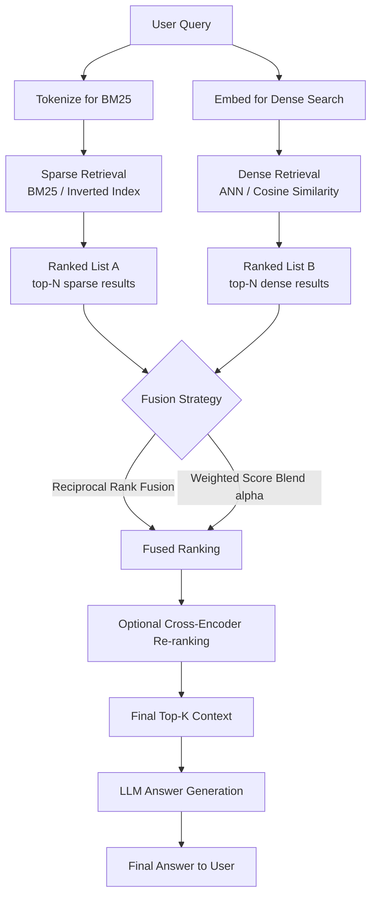

## 1. Introduction

The previous two techniques in this series covered two fundamentally different retrieval philosophies:

- **Sparse (Keyword) Retrieval — BM25**: matches exact/lexical terms; excellent for identifiers, codes, and rare terminology
- **Dense (Embedding) Retrieval**: matches semantic meaning; excellent for paraphrasing, synonyms, and conversational queries

Neither is strictly better — each has blind spots the other covers. **Hybrid Search** combines both retrieval methods and **fuses their results into a single ranked list**, giving you the lexical precision of BM25 *and* the semantic breadth of embeddings in one retrieval pass.

> **Hybrid Search = Sparse Retrieval + Dense Retrieval + Score/Rank Fusion**

This is now considered the **default best practice** for production RAG systems, and is natively supported by most modern vector databases (Weaviate, Pinecone, Qdrant, Elasticsearch, Azure AI Search, Vespa).

---

## 2. Why Hybrid Search Is Needed

Neither pure sparse nor pure dense retrieval is sufficient across all query types in a real knowledge base:

| Query Type | Sparse (BM25) Alone | Dense (Embeddings) Alone | Hybrid |
|---|---|---|---|
| "What does error `ERR_502_GATEWAY` mean?" | ✅ Exact match wins | ❌ May miss rare token | ✅ Correct + related context |
| "My invoice looks wrong, can someone check it?" | ❌ No word overlap with "billing discrepancy" doc | ✅ Semantic match wins | ✅ Correct |
| "cancel subscription plan Q3 2024 invoice #4092" | ✅ Catches exact invoice number | ⚠️ May dilute score across generic terms | ✅ Both signals combine |
| Conversational/vague query | ⚠️ Weak, no strong keyword anchor | ✅ Strong | ✅ Robust |

A single retrieval method is a compromise. **Hybrid search removes the compromise** by running both in parallel and merging results — at the cost of some added complexity and computation.

---

## 3. Core Concepts

### 3.1 Two Retrieval Signals, One Result Set

Hybrid search runs the *same* query text through two independent retrieval pipelines simultaneously:

1. **Sparse pipeline**: query → tokenize → BM25 score against inverted index → ranked list A
2. **Dense pipeline**: query → embed → ANN cosine similarity search → ranked list B

### 3.2 Fusion Strategies

There are two dominant ways to combine ranked list A and ranked list B into one final ranking:

#### a) Reciprocal Rank Fusion (RRF) — Rank-Based, No Score Normalization Needed

RRF ignores the raw scores (which are on completely different scales — BM25 scores are unbounded, cosine similarity is 0-1) and instead uses each document's **rank position** in each list.

```
RRF_score(doc) = Σ over each retrieval method [ 1 / (k + rank_of_doc_in_that_method) ]
```

Typically `k = 60`. Documents that rank highly in *either or both* lists accumulate higher fused scores. This is the most popular fusion method because it requires **no score normalization or tuning**.

#### b) Weighted Score Fusion (Convex Combination / "Alpha" Blending)

Normalize both score sets (e.g., min-max normalization) to a comparable 0-1 range, then combine with a tunable weight `alpha`:

```
hybrid_score = alpha * normalized_dense_score + (1 - alpha) * normalized_sparse_score
```

- `alpha = 1.0` → pure dense retrieval
- `alpha = 0.0` → pure sparse retrieval
- `alpha = 0.5` → equal blend (common default)

This gives finer control but requires tuning `alpha` per domain/dataset, and score normalization can be tricky since BM25 and cosine similarity distributions differ significantly.

### 3.3 Candidate Pool Size

A common pattern: retrieve top-N (e.g., N=20) from *each* method before fusing, so the final fused top-K (e.g., K=5) has a wide enough pool to draw genuinely relevant results from both signals — not just whichever method happened to return fewer results.

### 3.4 Optional Third Stage: Cross-Encoder Re-ranking

Even after fusion, a lightweight cross-encoder can re-score the fused top-N for final precision, since it can model query-document interaction directly (as covered in the Dense Retrieval doc).

```
Sparse (BM25) ─┐
                ├─► Fusion (RRF / weighted) ─► Cross-Encoder Re-rank ─► Final Top-K
Dense (Vector) ─┘
```

---

## 4. Workflow Diagram



---

## 5. Real-Time Example

**Scenario:** A developer-facing support assistant for a cloud platform, covering documentation, API references, and troubleshooting guides.

**User asks:**
> "My deployment keeps failing with ERR_502_GATEWAY after I updated the billing plan"

This single query has **two distinct retrieval needs at once**:

1. An **exact identifier** — `ERR_502_GATEWAY` — best served by sparse/BM25
2. A **conceptual/semantic** phrase — "deployment keeps failing... after updated billing plan" — best served by dense embeddings, since the actual relevant doc might phrase it as *"deployment interruptions following subscription tier changes"*

### What each method alone would return:

| Method | Top Result |
|---|---|
| **Sparse only** | ✅ `ERR_502_GATEWAY troubleshooting guide` (exact match) — but misses the billing-plan-change correlation doc entirely |
| **Dense only** | ✅ `Deployment interruptions following subscription tier changes` — but might rank the exact error code doc lower, diluted by generic "deployment failure" semantics |

### What hybrid search returns:

Both relevant documents surface in the fused top results — the exact error-code reference **and** the semantically related billing-change doc — giving the LLM everything it needs to correctly explain that the deployment failure is *caused by* the billing plan change, not just describe the error code in isolation.

---

## 6. Code Implementation

### 6.1 From-Scratch Hybrid Search with RRF

```python
from rank_bm25 import BM25Okapi
from openai import OpenAI
import numpy as np
import re

client = OpenAI()

def tokenize(text: str):
    return re.findall(r"[a-z0-9_]+", text.lower())

def embed(text: str) -> np.ndarray:
    resp = client.embeddings.create(model="text-embedding-3-small", input=text)
    return np.array(resp.data[0].embedding)

def cosine_similarity(a, b):
    return float(np.dot(a, b) / (np.linalg.norm(a) * np.linalg.norm(b)))

# --- Corpus ---
corpus = [
    "ERR_502_GATEWAY: Upstream Server Timeout - Troubleshooting Guide for failed deployments.",
    "Deployment interruptions following subscription tier changes: billing plan updates can trigger temporary service restarts.",
    "API rate limiting policy: requests are throttled at 100 requests per minute per API key.",
    "How to reset your password: navigate to account settings.",
]

# --- Build both indexes ---
tokenized_corpus = [tokenize(doc) for doc in corpus]
bm25 = BM25Okapi(tokenized_corpus)
dense_embeddings = [embed(doc) for doc in corpus]

# --- Retrieval functions returning ranked doc indices ---
def sparse_retrieve(query, k=10):
    scores = bm25.get_scores(tokenize(query))
    return sorted(range(len(scores)), key=lambda i: scores[i], reverse=True)[:k]

def dense_retrieve(query, k=10):
    q_emb = embed(query)
    sims = [cosine_similarity(q_emb, d) for d in dense_embeddings]
    return sorted(range(len(sims)), key=lambda i: sims[i], reverse=True)[:k]

# --- Reciprocal Rank Fusion ---
def reciprocal_rank_fusion(rank_lists, k=60):
    fused_scores = {}
    for rank_list in rank_lists:
        for rank, doc_idx in enumerate(rank_list):
            fused_scores.setdefault(doc_idx, 0.0)
            fused_scores[doc_idx] += 1.0 / (k + rank + 1)
    return sorted(fused_scores, key=lambda x: fused_scores[x], reverse=True)

# --- Run hybrid search ---
query = "My deployment keeps failing with ERR_502_GATEWAY after I updated the billing plan"

sparse_ranked = sparse_retrieve(query)
dense_ranked = dense_retrieve(query)
final_ranking = reciprocal_rank_fusion([sparse_ranked, dense_ranked])

print("Hybrid search results (best first):")
for idx in final_ranking:
    print(f"-> {corpus[idx]}")
```

### 6.2 Weighted Score Fusion (Alpha Blending) — Manual Implementation

```python
def min_max_normalize(scores):
    scores = np.array(scores, dtype=float)
    if scores.max() == scores.min():
        return np.zeros_like(scores)
    return (scores - scores.min()) / (scores.max() - scores.min())

def hybrid_weighted_search(query, alpha=0.5, k=5):
    # Get raw scores for the FULL corpus (not just top-k) so normalization is meaningful
    sparse_scores = bm25.get_scores(tokenize(query))
    q_emb = embed(query)
    dense_scores = [cosine_similarity(q_emb, d) for d in dense_embeddings]

    norm_sparse = min_max_normalize(sparse_scores)
    norm_dense = min_max_normalize(dense_scores)

    hybrid_scores = alpha * norm_dense + (1 - alpha) * norm_sparse

    ranked = sorted(range(len(hybrid_scores)), key=lambda i: hybrid_scores[i], reverse=True)
    return [(corpus[i], hybrid_scores[i]) for i in ranked[:k]]

# alpha=0.5 -> equal blend; try 0.3 (favor keyword) or 0.7 (favor semantic) depending on domain
results = hybrid_weighted_search(query, alpha=0.5)
for doc, score in results:
    print(f"{score:.3f} -> {doc}")
```

### 6.3 Native Hybrid Search — Weaviate

```python
import weaviate
from weaviate.classes.query import HybridFusion

client = weaviate.connect_to_local()
collection = client.collections.get("SupportDocs")

response = collection.query.hybrid(
    query="My deployment keeps failing with ERR_502_GATEWAY after I updated the billing plan",
    alpha=0.5,  # 0 = pure keyword (BM25), 1 = pure vector
    fusion_type=HybridFusion.RELATIVE_SCORE,  # or RANKED (RRF-style)
    limit=5,
)

for obj in response.objects:
    print(obj.properties["content"], "-> score:", obj.metadata.score)

client.close()
```

### 6.4 Native Hybrid Search — Pinecone (Sparse-Dense Vectors)

```python
from pinecone import Pinecone
from pinecone_text.sparse import BM25Encoder

pc = Pinecone(api_key="YOUR_API_KEY")
index = pc.Index("hybrid-support-kb")

bm25_encoder = BM25Encoder().fit(corpus)  # fit on your corpus text

def hybrid_upsert(doc_id, text):
    dense_vec = embed(text).tolist()
    sparse_vec = bm25_encoder.encode_documents([text])[0]
    index.upsert(vectors=[{
        "id": doc_id,
        "values": dense_vec,
        "sparse_values": sparse_vec,
        "metadata": {"text": text},
    }])

def hybrid_query(query_text, alpha=0.5, top_k=5):
    dense_vec = embed(query_text).tolist()
    sparse_vec = bm25_encoder.encode_queries([query_text])[0]

    # Scale sparse/dense contributions by alpha before querying
    scaled_sparse = {
        "indices": sparse_vec["indices"],
        "values": [v * (1 - alpha) for v in sparse_vec["values"]],
    }
    scaled_dense = [v * alpha for v in dense_vec]

    return index.query(
        vector=scaled_dense,
        sparse_vector=scaled_sparse,
        top_k=top_k,
        include_metadata=True,
    )

response = hybrid_query("My deployment keeps failing with ERR_502_GATEWAY after I updated the billing plan")
for match in response["matches"]:
    print(match["score"], match["metadata"]["text"])
```

### 6.5 Hybrid Search + Final Cross-Encoder Re-ranking (Full Production Pipeline)

```python
from sentence_transformers import CrossEncoder

cross_encoder = CrossEncoder("cross-encoder/ms-marco-MiniLM-L-6-v2")

def full_hybrid_pipeline(query, top_n_per_method=10, final_k=5):
    sparse_ranked = sparse_retrieve(query, k=top_n_per_method)
    dense_ranked = dense_retrieve(query, k=top_n_per_method)
    fused_indices = reciprocal_rank_fusion([sparse_ranked, dense_ranked])

    # Take a generous candidate pool into re-ranking
    candidates = [corpus[i] for i in fused_indices[:top_n_per_method]]

    pairs = [[query, doc] for doc in candidates]
    rerank_scores = cross_encoder.predict(pairs)

    reranked = sorted(zip(rerank_scores, candidates), key=lambda x: x[0], reverse=True)
    return reranked[:final_k]


final_results = full_hybrid_pipeline(query)
for score, doc in final_results:
    print(f"{score:.3f} -> {doc}")
```

---

## 7. RRF vs. Weighted Fusion — Which to Use?

| Aspect | Reciprocal Rank Fusion (RRF) | Weighted Score Fusion (Alpha) |
|---|---|---|
| **Needs score normalization?** | ❌ No — rank-based | ✅ Yes — scores must be normalized to comparable ranges |
| **Tuning required** | Minimal (just `k`, rarely changed from 60) | Requires tuning `alpha` per domain/dataset |
| **Robustness** | ✅ Very robust across different score distributions | ⚠️ Sensitive to normalization method and outlier scores |
| **Interpretability** | Rank-based, less intuitive | Score-based, easier to reason about ("70% semantic weight") |
| **Native DB support** | Widely supported (Weaviate `RANKED`, Elasticsearch RRF) | Widely supported (Weaviate `RELATIVE_SCORE`, Pinecone alpha) |
| **Recommended default** | ✅ Yes, for most use cases | Use when you need fine-grained control and have data to tune `alpha` |

---

## 8. Advantages of Hybrid Search

- **Best of both worlds** — lexical precision (exact IDs, codes, rare terms) + semantic recall (paraphrasing, synonyms)
- **More robust across query types** — handles both keyword-heavy and conversational queries well without needing to guess which mode fits
- **Reduces retrieval failure modes** — a document only needs to be found by *one* of the two methods to enter the fused candidate pool
- **Native support in modern infra** — no need to build fusion logic from scratch in most production vector databases

## 9. Trade-offs & Considerations

- **Higher computational cost** — running two retrieval pipelines (plus optional re-ranking) costs more than one
- **Added complexity** — requires maintaining both a sparse index (inverted index/BM25) and a dense index (ANN/vector index)
- **Fusion tuning** — weighted fusion requires domain-specific `alpha` tuning; poor tuning can underweight the more useful signal for your data
- **Latency** — two retrieval calls + fusion + optional re-ranking adds up; parallelize sparse and dense calls to minimize impact

## 10. When to Use Hybrid Search

Best suited for:
- Production RAG systems with mixed query types (some conversational, some containing exact identifiers/codes)
- Technical, legal, medical, or enterprise domains where both jargon-heavy exact terms and natural-language questions coexist
- Any system where retrieval quality directly impacts user trust (customer support, compliance, internal knowledge assistants)

Less critical for:
- Very small, narrow-domain corpora where one method alone already performs well
- Extremely latency-constrained applications where the cost of dual retrieval isn't justified

## 11. Summary: The Modern RAG Retrieval Stack

```
Hybrid Search = Sparse (BM25) + Dense (Embeddings) + Fusion (RRF/Weighted) + Optional Cross-Encoder Re-rank
```

This is now the de facto standard architecture recommended by most vector database vendors (Weaviate, Pinecone, Elasticsearch, Azure AI Search, Vespa) and is the safest default choice when building a new production RAG pipeline — pure sparse-only or dense-only retrieval should generally be treated as a simplification made for speed/cost, not as the ideal end state.
