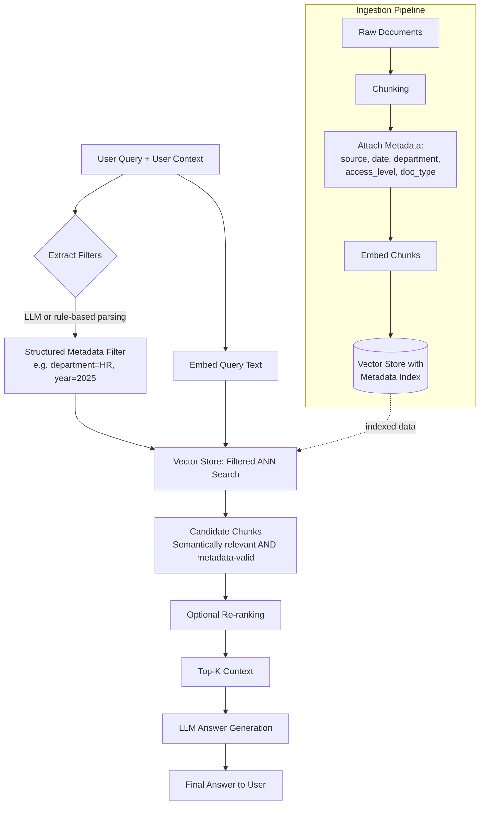

## 1. Introduction

Pure vector similarity search retrieves chunks based purely on **semantic closeness** between the query embedding and document embeddings. This works well for meaning, but it has a blind spot: **vector similarity has no concept of structured constraints** like date, author, department, product category, access permissions, or document type.

**Metadata Filtering** solves this by attaching structured key-value metadata to each chunk at ingestion time (e.g., `{"department": "HR", "year": 2025, "doc_type": "policy"}`) and applying **hard filters** on that metadata *before or during* the vector search — so the LLM only ever sees candidates that are both semantically relevant **and** structurally valid.

> Think of it as combining a **SQL WHERE clause** with a **semantic similarity search**.

---

## 2. Why It's Needed

### 2.1 The Problem Without Metadata Filtering

| User Query | What Pure Vector Search Might Return |
|---|---|
| "What was our Q1 2024 revenue?" | Chunks about Q1 2023, Q3 2024, or a competitor's revenue — all semantically similar to "revenue" |
| "Show me the latest security policy" | An outdated 2019 security policy that's semantically close but factually stale |
| "What's in the Engineering handbook?" | Content from the Marketing handbook, since both mention "handbook", "onboarding", "policy" |
| "Show me documents I'm authorized to see" | Confidential documents belonging to other teams/users (a security risk!) |

Vector similarity alone cannot distinguish **recency**, **scope/ownership**, **access control**, or **categorical correctness** — it only measures "these texts mean similar things."

### 2.2 What Metadata Filtering Adds

- **Precision narrowing**: restrict search to a subset of the corpus (e.g., `year = 2024`)
- **Access control / multi-tenancy**: only retrieve documents the requesting user is permitted to see
- **Freshness control**: exclude expired/deprecated documents
- **Category/domain routing**: search only within a relevant document type (e.g., `doc_type = "invoice"`)

---

## 3. Core Concepts

| Concept | Description |
|---|---|
| **Metadata Schema** | The structured fields attached to each chunk (e.g., `source`, `date`, `author`, `department`, `access_level`, `doc_type`, `tags`) |
| **Pre-filtering** | Apply metadata filter **first** to reduce the candidate pool, then run vector similarity only on that subset |
| **Post-filtering** | Run vector similarity search first (larger top-k), then discard results that don't match metadata — less efficient, but easier with some vector stores |
| **Hybrid Filtering** | Native support in most modern vector DBs (Pinecone, Weaviate, Qdrant, Chroma, Milvus) to filter *and* search in a single indexed operation, avoiding a full post-scan |
| **Filter DSL** | The query language used to express filters — usually a JSON-like syntax supporting `eq`, `in`, `gte`, `lte`, `and`, `or`, `not` |
| **Auto-Metadata Extraction** | Using an LLM to infer structured metadata filters directly from a natural language query (e.g., "docs from last year" → `{"year": 2025}`) |

---

## 4. Workflow Diagram



---

## 5. Real-Time Example

**Scenario:** An internal company knowledge assistant used across departments (HR, Finance, Engineering), with document access restricted by role, and containing multiple years of policy revisions.

**User (Finance team, mid-level employee) asks:**
> "What's the current expense reimbursement policy?"

### Without metadata filtering:
The vector search might return:
- The 2021 expense policy (outdated)
- The Engineering team's "hardware reimbursement" doc (wrong department)
- A Finance policy doc that's semantically similar but is actually the **travel booking** policy, not reimbursement

### With metadata filtering:
The system infers filters from the query + user session context:

```json
{
  "department": {"in": ["Finance", "Company-Wide"]},
  "doc_type": "policy",
  "topic": "expense_reimbursement",
  "status": "active",
  "access_level": {"lte": "employee"}
}
```

Now the vector search is restricted to only **active**, **Finance-scoped**, **reimbursement-related** policy documents that this employee is authorized to view. Result: the LLM receives exactly the 2025 active reimbursement policy — no outdated versions, no unrelated departments, no access violations.

---

## 6. Code Implementation

### 6.1 Ingestion — Attaching Metadata to Chunks

```python
from langchain_openai import OpenAIEmbeddings
from langchain_community.vectorstores import Chroma
from langchain_core.documents import Document
from datetime import datetime

embeddings = OpenAIEmbeddings(model="text-embedding-3-small")

raw_chunks = [
    {
        "text": "Employees may claim reimbursement for business travel expenses up to $500/month without pre-approval.",
        "metadata": {
            "department": "Finance",
            "doc_type": "policy",
            "topic": "expense_reimbursement",
            "year": 2025,
            "status": "active",
            "access_level": "employee",
        },
    },
    {
        "text": "The 2021 expense reimbursement policy capped claims at $300/month.",
        "metadata": {
            "department": "Finance",
            "doc_type": "policy",
            "topic": "expense_reimbursement",
            "year": 2021,
            "status": "archived",
            "access_level": "employee",
        },
    },
    {
        "text": "Engineering hardware reimbursement covers laptops and monitors up to $1200/year.",
        "metadata": {
            "department": "Engineering",
            "doc_type": "policy",
            "topic": "hardware_reimbursement",
            "year": 2025,
            "status": "active",
            "access_level": "employee",
        },
    },
]

docs = [Document(page_content=c["text"], metadata=c["metadata"]) for c in raw_chunks]
vectorstore = Chroma.from_documents(docs, embeddings, collection_name="company_kb")
```

### 6.2 Query-Time Filtering (LangChain / Chroma)

```python
def retrieve_with_filters(query: str, user_department: str, k: int = 5):
    metadata_filter = {
        "$and": [
            {"status": {"$eq": "active"}},
            {"department": {"$in": [user_department, "Company-Wide"]}},
            {"topic": {"$eq": "expense_reimbursement"}},
        ]
    }

    results = vectorstore.similarity_search(
        query=query,
        k=k,
        filter=metadata_filter,
    )
    return results


results = retrieve_with_filters(
    query="What's the current expense reimbursement policy?",
    user_department="Finance",
)

for r in results:
    print(r.metadata, "->", r.page_content)
```

### 6.3 LLM-Based Automatic Filter Extraction

Rather than hardcoding filters, you can let an LLM parse the user's natural-language query into structured filters — this is the approach used by LangChain's `SelfQueryRetriever`.

```python
import json
from openai import OpenAI

client = OpenAI()

METADATA_SCHEMA = {
    "department": "string, one of [HR, Finance, Engineering, Company-Wide]",
    "doc_type": "string, one of [policy, invoice, memo, handbook]",
    "year": "integer",
    "status": "string, one of [active, archived]",
}

def extract_filters(natural_query: str) -> dict:
    prompt = f"""Extract a metadata filter as JSON from the user's question.
Schema fields available: {json.dumps(METADATA_SCHEMA, indent=2)}
Only include fields you can confidently infer. Always include "status": "active" unless the user asks for historical/old versions.
Return ONLY valid JSON, no explanation.

User question: "{natural_query}"
"""
    response = client.chat.completions.create(
        model="gpt-4o-mini",
        messages=[{"role": "user", "content": prompt}],
        temperature=0,
    )
    return json.loads(response.choices[0].message.content)


filters = extract_filters("Show me last year's HR handbook, including old versions")
print(filters)
# Example output: {"department": "HR", "doc_type": "handbook", "year": 2024}
```

### 6.4 Native Filtering in Pinecone (Production-Scale Example)

```python
from pinecone import Pinecone

pc = Pinecone(api_key="YOUR_API_KEY")
index = pc.Index("company-kb")

query_embedding = embeddings.embed_query("What's the current expense reimbursement policy?")

response = index.query(
    vector=query_embedding,
    top_k=5,
    filter={
        "status": {"$eq": "active"},
        "department": {"$in": ["Finance", "Company-Wide"]},
        "topic": {"$eq": "expense_reimbursement"},
    },
    include_metadata=True,
)

for match in response["matches"]:
    print(match["score"], match["metadata"])
```

### 6.5 Access-Control Enforcement Pattern (Security-Critical)

```python
def secure_retrieve(query: str, user_role: str, user_dept: str, k: int = 5):
    """
    Ensures retrieval NEVER returns documents above the user's access level,
    regardless of semantic similarity score.
    """
    access_hierarchy = {"employee": 0, "manager": 1, "admin": 2}
    user_level = access_hierarchy[user_role]

    allowed_levels = [
        level for level, rank in access_hierarchy.items() if rank <= user_level
    ]

    metadata_filter = {
        "$and": [
            {"access_level": {"$in": allowed_levels}},
            {"department": {"$in": [user_dept, "Company-Wide"]}},
            {"status": {"$eq": "active"}},
        ]
    }

    return vectorstore.similarity_search(query=query, k=k, filter=metadata_filter)
```

> **Security note:** Metadata filtering used for access control should be enforced at the **retrieval layer**, never left to the LLM to "decide" whether to use a document — the LLM should never even see documents it isn't authorized to view.

---

## 7. Pre-filtering vs. Post-filtering

| Approach | How It Works | Pros | Cons |
|---|---|---|---|
| **Pre-filtering** | Metadata filter applied before/during ANN search (native in Pinecone, Weaviate, Qdrant, Milvus) | Efficient — searches only the valid subset; no wasted top-k slots | Requires vector DB with indexed metadata filtering support |
| **Post-filtering** | Retrieve large top-k via pure vector search, then filter results afterward | Works with any vector store, even without native filter support | Inefficient at scale; risk of filtering out *all* results if top-k wasn't large enough |

**Rule of thumb:** Always prefer pre-filtering / native hybrid filtering when your vector database supports it (most modern ones do).

---

## 8. Advantages

- **Precision** — eliminates entire categories of irrelevant results before semantic ranking even happens
- **Security & compliance** — enforces access control and multi-tenancy at the retrieval layer, not just in the prompt
- **Freshness** — easily excludes deprecated/archived content
- **Efficient at scale** — narrowing the search space before ANN search improves both speed and relevance in large corpora (millions of chunks)
- **Composable** — works seamlessly alongside Multi-Query Retrieval, hybrid (BM25 + vector) search, and re-ranking

## 9. Trade-offs & Considerations

- **Schema design overhead** — requires upfront planning of what metadata fields matter for your domain
- **Over-filtering risk** — overly strict filters can return zero results if metadata is inconsistent or a field is mis-extracted
- **Metadata quality dependency** — filtering is only as good as the metadata tagging at ingestion time; garbage in, garbage out
- **LLM-based filter extraction errors** — auto-extracted filters can misinterpret ambiguous queries; consider fallback logic (retry without filter, or ask a clarifying question) when zero results are returned

## 10. When to Use Metadata Filtering

Best suited for:
- Multi-tenant systems (SaaS platforms where each customer's data must stay isolated)
- Enterprise knowledge bases with document versioning/recency requirements
- Systems requiring role-based access control (RBAC) over retrieved content
- Large corpora spanning multiple categories/domains where scoping search improves both speed and accuracy

Less critical for:
- Small, single-purpose corpora with no access control needs
- Corpora where all documents are equally current and equally relevant to all users
