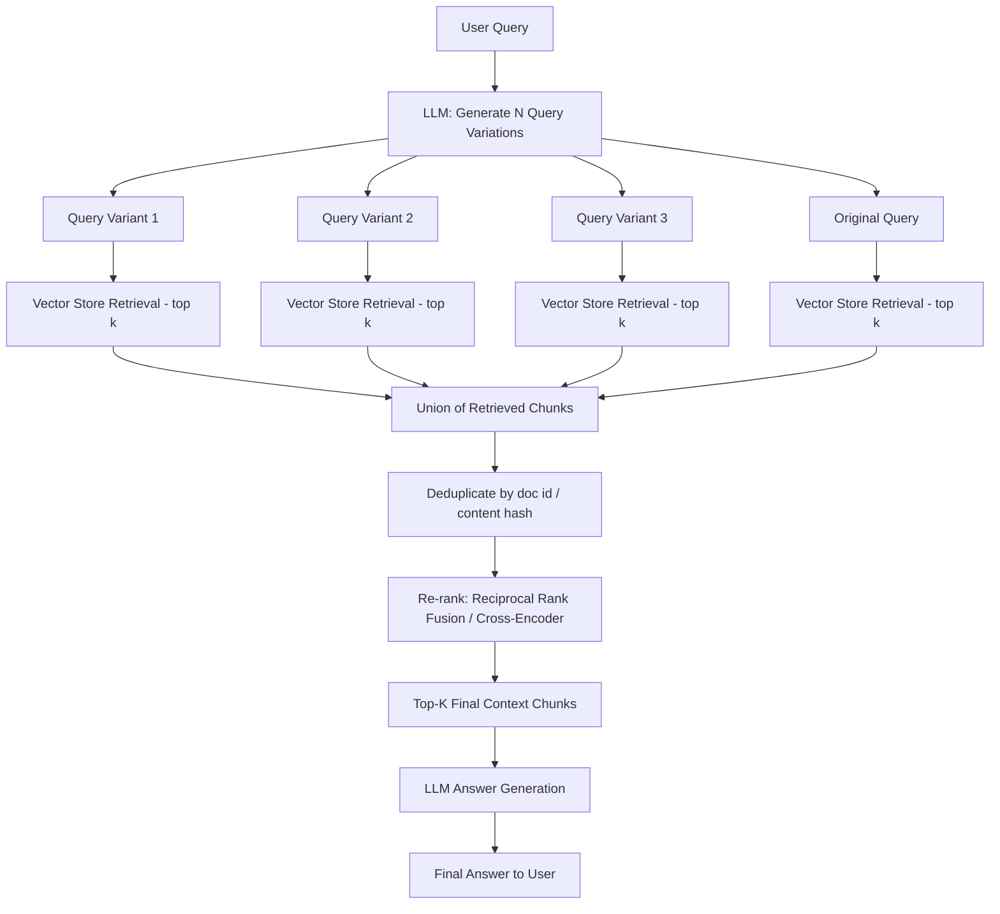

## 1. Introduction

Retrieval-Augmented Generation (RAG) systems answer questions by first **retrieving** relevant documents from a knowledge base (usually a vector database) and then **generating** an answer using an LLM conditioned on those documents.

The weakest link in most RAG pipelines is not the LLM — it's the **retrieval step**. A single user query is often:

- **Ambiguous** ("What is the return policy?" — return of what? electronics? clothing?)
- **Under-specified** (missing synonyms, domain terms, or related phrasing)
- **Poorly aligned** with how the answer is phrased in the source documents (vocabulary mismatch)

Because vector similarity search retrieves documents based on the *embedding* of the query, a single phrasing of a question only explores **one point** in embedding space. If the best-matching chunk in your knowledge base uses different terminology, it may fall outside the top-k results — even if it's the most relevant chunk available.

**Multi-Query Retrieval (MQR)** solves this by generating **multiple reformulations** of the original query, retrieving documents for each, and then merging/deduplicating the results into a single, richer candidate set.

---

## 2. Core Concept

> Instead of asking the vector store one question, ask it the same question in several different ways — then combine the answers.

### 2.1 The Problem It Solves: Vocabulary & Perspective Mismatch

| User Query | Document Chunk (relevant, but missed) |
|---|---|
| "How do I cancel my subscription?" | "Steps to **terminate** your **membership plan**" |
| "Is the API rate limited?" | "**Throttling** policy for **request quotas**" |
| "Why is my app crashing?" | "Troubleshooting **unexpected application termination**" |

A single embedding of "cancel my subscription" may sit far away from "terminate your membership plan" in vector space, even though they mean the same thing. Multiple phrasings increase the odds of a semantic hit.

### 2.2 How Multi-Query Retrieval Works (High Level)

1. **Query Expansion** — An LLM takes the original user question and generates *N* semantically diverse but intent-preserving variations.
2. **Parallel Retrieval** — Each variation is embedded and used to query the vector store independently (top-k per query).
3. **Union & Deduplication** — All retrieved chunks are merged into a single candidate pool, removing duplicates (by document ID or content hash).
4. **Re-ranking (optional but recommended)** — The merged pool is re-scored using techniques like **Reciprocal Rank Fusion (RRF)** or a cross-encoder re-ranker, since chunks retrieved by more than one query variant are usually more relevant.
5. **Context Assembly** — Top re-ranked chunks are passed to the LLM as context for final answer generation.

---

## 3. Workflow Diagram




---

## 4. Real-Time Example

**Scenario:** An internal HR knowledge-base chatbot at a company.

**User asks:**
> "Can I work from home permanently?"

**Problem with single-query retrieval:**
The knowledge base has a document titled *"Remote Work & Flexible Location Policy"* that uses terms like *"telecommute," "distributed workforce,"* and *"location-independent employment."* The literal phrase "work from home permanently" never appears, so a single vector search might miss it or rank it low.

**Multi-Query Retrieval generates:**
1. "Can I work from home permanently?" (original)
2. "What is the company's remote work policy?"
3. "Is permanent telecommuting allowed for employees?"
4. "Rules for full-time distributed / location-independent work"

**Result:** Query variant 3 and 4 hit the "Remote Work & Flexible Location Policy" document directly, while variant 2 pulls in a related "Hybrid Work Guidelines" doc. After deduplication and re-ranking, the LLM now has both documents to synthesize a complete, accurate answer — something the original query alone would likely have missed.

---

## 5. Code Implementation

### 5.1 Using LangChain's Built-in `MultiQueryRetriever`

```python
from langchain_openai import ChatOpenAI, OpenAIEmbeddings
from langchain_community.vectorstores import Chroma
from langchain.retrievers.multi_query import MultiQueryRetriever
from langchain_core.documents import Document

# 1. Set up embeddings + vector store (example documents)
docs = [
    Document(page_content="Steps to terminate your membership plan: go to Settings > Billing > Cancel."),
    Document(page_content="Throttling policy for request quotas: 100 requests/minute per API key."),
    Document(page_content="Remote Work & Flexible Location Policy: employees may telecommute full-time with manager approval."),
    Document(page_content="Hybrid Work Guidelines: employees must be in-office at least 2 days per week."),
]

embeddings = OpenAIEmbeddings(model="text-embedding-3-small")
vectorstore = Chroma.from_documents(docs, embeddings)

# 2. LLM used to generate query variations
llm = ChatOpenAI(model="gpt-4o-mini", temperature=0)

# 3. Wrap the base retriever with MultiQueryRetriever
retriever = MultiQueryRetriever.from_llm(
    retriever=vectorstore.as_retriever(search_kwargs={"k": 3}),
    llm=llm,
)

# 4. Run it
query = "Can I work from home permanently?"
results = retriever.invoke(query)

for i, doc in enumerate(results, 1):
    print(f"[{i}] {doc.page_content}")
```

### 5.2 Manual / From-Scratch Implementation (No Framework)

This version is useful when you want full control over prompt design, deduplication, and re-ranking (e.g., Reciprocal Rank Fusion).

```python
import openai
from typing import List, Dict
import numpy as np

client = openai.OpenAI()

# ---- Step 1: Generate query variations ----
def generate_query_variations(original_query: str, n: int = 4) -> List[str]:
    prompt = f"""You are an AI assistant helping improve search recall.
Generate {n} different ways to phrase the following question.
Preserve the original intent, but vary vocabulary, phrasing, and perspective.
Return ONLY the questions, one per line, no numbering.

Original question: {original_query}
"""
    response = client.chat.completions.create(
        model="gpt-4o-mini",
        messages=[{"role": "user", "content": prompt}],
        temperature=0.7,
    )
    variations = response.choices[0].message.content.strip().split("\n")
    variations = [v.strip("- ").strip() for v in variations if v.strip()]
    return [original_query] + variations  # include the original


# ---- Step 2: Embed and retrieve per query variant ----
def embed_text(text: str) -> List[float]:
    resp = client.embeddings.create(model="text-embedding-3-small", input=text)
    return resp.data[0].embedding


def cosine_similarity(a: List[float], b: List[float]) -> float:
    a, b = np.array(a), np.array(b)
    return float(np.dot(a, b) / (np.linalg.norm(a) * np.linalg.norm(b)))


def retrieve_top_k(query: str, corpus: List[Dict], k: int = 3) -> List[Dict]:
    q_emb = embed_text(query)
    scored = [
        {**doc, "score": cosine_similarity(q_emb, doc["embedding"])}
        for doc in corpus
    ]
    return sorted(scored, key=lambda x: x["score"], reverse=True)[:k]


# ---- Step 3: Reciprocal Rank Fusion for merging results ----
def reciprocal_rank_fusion(result_lists: List[List[Dict]], k: int = 60) -> List[Dict]:
    fused_scores: Dict[str, float] = {}
    doc_lookup: Dict[str, Dict] = {}

    for result_list in result_lists:
        for rank, doc in enumerate(result_list):
            doc_id = doc["id"]
            doc_lookup[doc_id] = doc
            fused_scores.setdefault(doc_id, 0.0)
            fused_scores[doc_id] += 1.0 / (k + rank + 1)  # RRF formula

    ranked_ids = sorted(fused_scores, key=lambda x: fused_scores[x], reverse=True)
    return [doc_lookup[doc_id] for doc_id in ranked_ids]


# ---- Step 4: Full pipeline ----
def multi_query_retrieval(original_query: str, corpus: List[Dict], n_variations: int = 4, top_k: int = 5):
    queries = generate_query_variations(original_query, n=n_variations)
    print("Generated queries:", queries)

    all_results = [retrieve_top_k(q, corpus, k=top_k) for q in queries]
    fused = reciprocal_rank_fusion(all_results)
    return fused[:top_k]


# ---- Example corpus (pre-embedded) ----
raw_docs = [
    {"id": "doc1", "text": "Steps to terminate your membership plan."},
    {"id": "doc2", "text": "Throttling policy for request quotas."},
    {"id": "doc3", "text": "Remote Work & Flexible Location Policy: telecommute full-time with approval."},
    {"id": "doc4", "text": "Hybrid Work Guidelines: in-office 2 days per week required."},
]
corpus = [{**d, "embedding": embed_text(d["text"])} for d in raw_docs]

results = multi_query_retrieval("Can I work from home permanently?", corpus)
for r in results:
    print(r["id"], "->", r["text"])
```

**Key formula — Reciprocal Rank Fusion (RRF):**

```
RRF_score(doc) = Σ over all query variants  [ 1 / (k + rank_of_doc_in_that_variant) ]
```

Documents that appear near the top across *multiple* query variants accumulate a higher fused score than documents that only appear once — this is what makes RRF effective at surfacing consistently relevant chunks.

---

## 6. Key Concepts Summary

| Concept | Description |
|---|---|
| **Query Expansion** | Using an LLM to generate N alternate phrasings of the user's question |
| **Parallel Retrieval** | Running vector similarity search independently for each query variant |
| **Deduplication** | Removing repeated chunks (same doc/chunk retrieved by multiple variants) |
| **Reciprocal Rank Fusion (RRF)** | A rank-based merging algorithm that rewards documents appearing across multiple result lists |
| **Cross-Encoder Re-ranking** | An optional second-stage model that scores (query, doc) pairs jointly for higher precision than embedding similarity alone |
| **Recall vs. Precision Tradeoff** | MQR boosts recall (more relevant docs found) but can hurt precision if not re-ranked properly |

---

## 7. Advantages

- **Higher recall** — catches relevant chunks that a single query phrasing would miss due to vocabulary mismatch
- **Robust to ambiguous queries** — different variants can capture different facets/interpretations of a vague question
- **Framework-agnostic** — works with any vector store (Chroma, Pinecone, Weaviate, FAISS, pgvector, etc.)
- **Composable** — can be combined with hybrid search (BM25 + vector), re-ranking, and metadata filtering

## 8. Trade-offs & Considerations

- **Latency** — N query variants means N retrieval calls (and one extra LLM call for generating variants); mitigate with parallel/async requests
- **Cost** — extra LLM calls for query generation add token cost at scale
- **Redundant noise** — poorly designed variant generation can introduce off-topic queries that pollute results; always re-rank or dedupe
- **Not a silver bullet** — for already well-specified queries with strong lexical overlap, MQR adds overhead without much benefit; consider adaptive strategies (only expand when initial retrieval confidence is low)

## 9. When to Use Multi-Query Retrieval

Best suited for:
- Enterprise knowledge bases with inconsistent terminology across documents/teams
- Customer support / HR / legal chatbots where users phrase things casually but docs are written formally
- Domains with many synonyms or jargon variants (medical, legal, technical support)

Less critical for:
- Small, homogeneous corpora with consistent vocabulary
- Latency-critical, real-time applications where the extra LLM call is too costly

                    User Question
                          │
                          ▼
                LLM Query Generator
                          │
      ┌─────────────┬─────────────┬─────────────┐
      ▼             ▼             ▼             ▼
 Original Query   Query 1      Query 2      Query 3
      │             │             │             │
      └──────┬──────┴──────┬──────┴──────┬──────┘
             ▼             ▼             ▼
        Vector Search  Vector Search  Vector Search
             │             │             │
             └─────────────┬─────────────┘
                           ▼
                Merge Retrieved Documents
                           ▼
                 Remove Duplicate Documents
                           ▼
                     Re-rank Documents
                           ▼
                        Top-K Results
                           ▼
                           LLM
                           ▼
                      Final Answer
