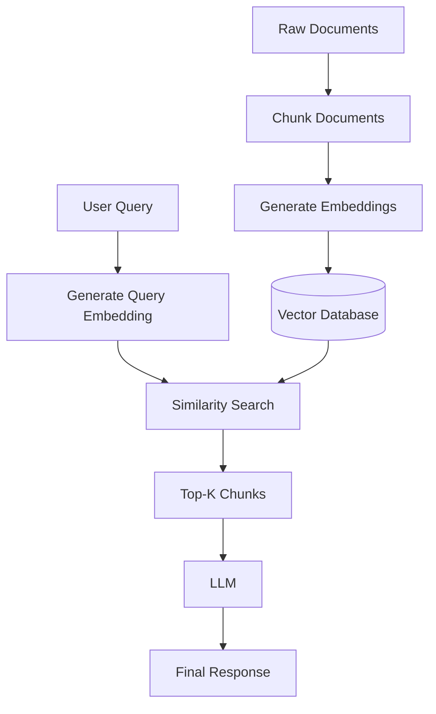

# 1. Introduction

Traditional keyword search retrieves documents based on **exact word matching**. While effective for literal queries, it struggles with synonyms, paraphrases, abbreviations, and natural language questions.

**Semantic Search** retrieves documents based on their **meaning (semantics)** rather than exact keywords. It converts both documents and user queries into **dense vector embeddings** using an embedding model. During retrieval, the vector database finds the documents whose embeddings are most similar to the query embedding.

Unlike keyword search, semantic search understands context and intent, allowing it to retrieve relevant documents even when different words are used.

> Think of Semantic Search as searching by **meaning**, not by **words**.

---

# 2. Why It's Needed

## 2.1 The Problem Without Semantic Search

| User Query | What Keyword Search Might Return |
|------------|----------------------------------|
| "How do I reset my password?" | Only documents containing "reset" |
| "Vehicle insurance" | Misses documents containing "car insurance" |
| "AI salary trends" | Misses "Artificial Intelligence Compensation Report" |
| "Laptop reimbursement" | Misses "Computer Equipment Policy" |

Keyword search cannot understand:

- Synonyms
- User intent
- Context
- Natural language
- Similar meanings

---

## 2.2 What Semantic Search Adds

- Retrieves documents based on meaning
- Understands synonyms and related concepts
- Supports conversational queries
- Improves retrieval accuracy
- Works even when wording is different
- Forms the foundation of modern RAG systems

---

# 3. Core Concepts

| Concept | Description |
|----------|-------------|
| Embedding Model | Converts text into numerical vectors |
| Embedding | Dense numerical representation of text |
| Vector Database | Stores embeddings for similarity search |
| Similarity Search | Finds vectors closest to the query vector |
| Cosine Similarity | Most common similarity metric |
| Top-K Retrieval | Returns the K most relevant chunks |
| ANN Search | Fast approximate nearest neighbor search |

---

# 4. Workflow Diagram

---

# 5. Real-Time Example

### User Query

> Explain Artificial Intelligence

### Documents

Document 1

Artificial Intelligence enables machines to perform tasks requiring human intelligence.

Document 2

Machine Learning is a subset of Artificial Intelligence.

Document 3

Cats are domestic animals.

### Retrieved Documents

✓ Document 1

✓ Document 2

✗ Document 3

Although the query does not exactly match the document text, Semantic Search retrieves the most semantically similar documents.

---

# 6. Code Implementation

The complete implementation is available in:

**semantic-search.py**

---

# 7. Similarity Metrics

| Metric | Description |
|----------|-------------|
| Cosine Similarity | Measures angle between vectors |
| Dot Product | Measures vector alignment |
| Euclidean Distance | Straight-line distance |
| Manhattan Distance | Sum of absolute differences |

Cosine Similarity is the most commonly used metric for Semantic Search.

---

# 8. Advantages

- Understands semantic meaning
- Retrieves contextually relevant documents
- Supports conversational search
- Handles synonyms automatically
- Improves RAG retrieval quality
- Scales efficiently with ANN search

---

# 9. Trade-offs & Considerations

- Embedding generation requires additional computation
- Vector storage consumes more memory
- Retrieval quality depends on embedding model
- Requires a vector database
- Similarity threshold and Top-K require tuning

---

# 10. When to Use Semantic Search

Best suited for:

- Retrieval-Augmented Generation (RAG)
- Enterprise Knowledge Bases
- AI Chatbots
- Question Answering
- Semantic Document Search
- Recommendation Systems

Less suitable for:

- Exact keyword lookup
- Searching IDs or invoice numbers
- SQL-style structured filtering

---

# 11. Semantic Search vs Keyword Search

| Feature | Keyword Search | Semantic Search |
|----------|----------------|-----------------|
| Matching | Exact Words | Meaning |
| Synonym Support | No | Yes |
| Intent Understanding | No | Yes |
| Embeddings | No | Yes |
| Vector Database | No | Yes |
| Natural Language | Limited | Excellent |
| Best Use Case | Exact Lookup | Intelligent Retrieval |